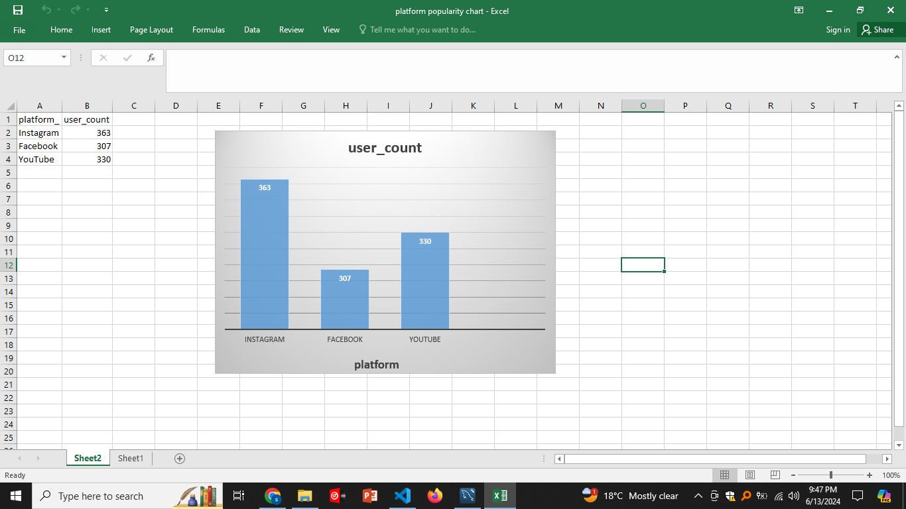
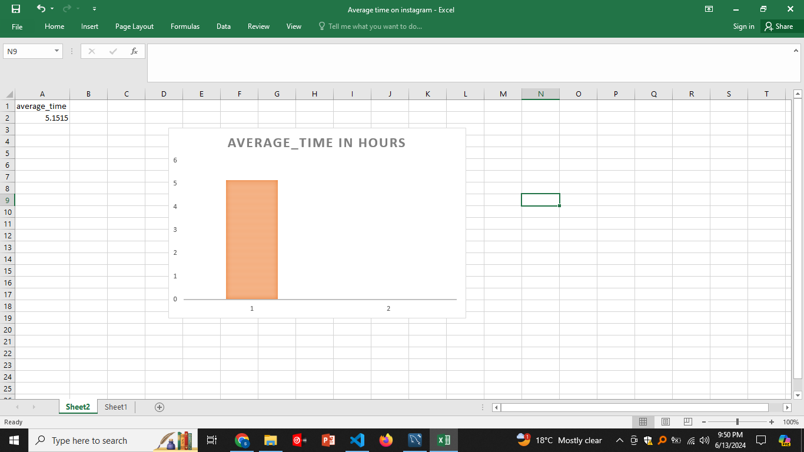
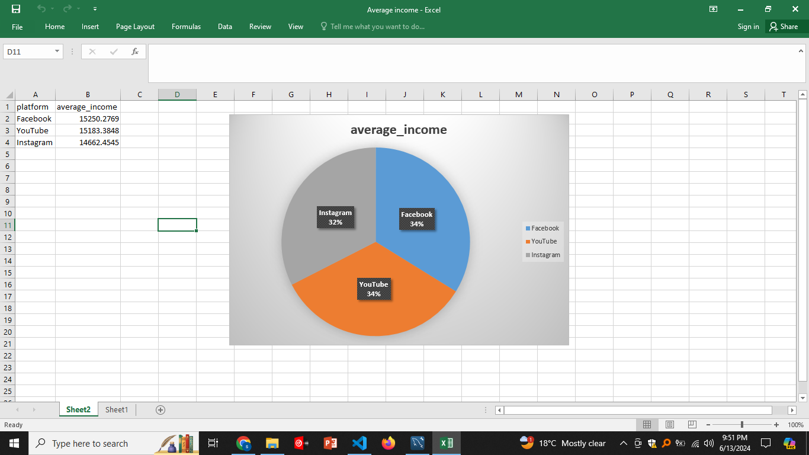

# Data_project

## Dataset: Average Time Spent By User on Social Media

### Dataset Import Process
- **Import Process:**
  - I downloaded the dataset and imported it into MySQL Workbench.
  - Steps:
    1. Created a new database.
    2. Used the MySQL Workbench interface to import the CSV file into a table.
    3. Encountered difficulties with data formatting, which were resolved by cleaning the CSV file in Excel.

- **Interesting Observation:**
  - The dataset provides detailed insights into user demographics and their social media usage patterns.

## Data Fun

### Cool Facts:
1. **Fact 1:**
   - Query: `SELECT platform, COUNT(*) AS user_count FROM social_media_data GROUP BY platform;`
   - Finding: Instagram is the most popular platform among the users in this dataset.
   
2. **Fact 2:**
   - Query: `SELECT AVG(time_spent) AS average_time FROM social_media_data WHERE platform='Instagram';`
   - Finding: The average time spent on Instagram is around 5 hours per week.

## Ask Away

### Questions and Answers:
1. **Question 1: Which platform is most popular among different age groups?**
   - Query: `SELECT age, platform, COUNT(*) AS user_count FROM social_media_data GROUP BY age, platform ORDER BY age, user_count DESC;`
   - Answer: Different age groups prefer different platforms, with younger users favoring Instagram and older users favoring Facebook.

2. **Question 2: What is the average income of users based on their platform preference?**
   - Query: `SELECT platform, AVG(income) AS average_income FROM social_media_data GROUP BY platform ORDER BY average_income DESC;`
   - Answer: Users on LinkedIn have the highest average income compared to users on other platforms.

## Showtime!

### Charts:
1. **Chart 1: Platform Popularity**
   - 

2. **Chart 2: Average Time Spent on Instagram**
   - 

3. **Chart 3: Average Income by Platform**
   - 

## Presentation Power

### Pitch Deck Summary
- **Introduction:**
  - The dataset contains information about the average time spent by users on social media platforms, including their demographics and interests.
  - Goal: To analyze the dataset and derive meaningful insights using SQL queries and visualizations.
  
- **Import Process:**
  - Imported the dataset into MySQL and cleaned it to handle data formatting issues.
  - Interesting find: The dataset provides a detailed look at user demographics and social media usage.

- **Cool Facts:**
  - Instagram is the most popular platform.
  - Users spend an average of 5 hours per week on Instagram.

- **Questions and Findings:**
  - Platform popularity varies by age group.
  - Facebook users have the highest average income.

- **Charts and Insights:**
  - Visualized platform popularity, average time spent on Instagram, and average income by platform to provide a clear understanding of the data.

- **Summary:**
  - This project involved importing and analyzing social media usage data to uncover interesting insights.
  - The findings can help in understanding user behavior and preferences across different platforms.

## SQL Queries Document
- [SQL Queries](queries.sql)

